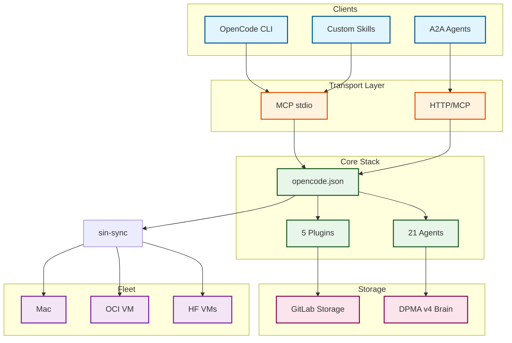

<a name="readme-top"></a>

# Upgraded OpenCode Stack

<p align="center">
  <a href="https://github.com/Delqhi/upgraded-opencode-stack/blob/main/LICENSE">
    
  </a>
  <a href="https://github.com/Delqhi/upgraded-opencode-stack/stargazers">
    
  </a>
  <a href="https://github.com/Delqhi/upgraded-opencode-stack/network/members">
    
  </a>
  <a href="https://github.com/Delqhi/upgraded-opencode-stack/last-commit">
    
  </a>
  <a href="https://www.python.org/downloads/">
    
  </a>
  <a href="https://github.com/modelcontextprotocol">
    
  </a>
</p>

<p align="center">
  <a href="#quick-start">Quick Start</a> ·
  <a href="#features">Features</a> ·
  <a href="#architecture">Architecture</a> ·
  <a href="#skills">Skills</a> ·
  <a href="#commands">Commands</a> ·
  <a href="#providers">Providers</a> ·
  <a href="#deploy">Deploy</a> ·
  <a href="#contributing">Contributing</a>
</p>

<p align="center">
  <em>Clone. Install. Run. Dein komplettes OpenCode-Setup — auf jedem Mac identisch.</em>
</p>

---

## Quick Start

<table>
<tr>
<td width="33%" align="center">
<strong>1. Clone</strong><br/><br/>
<code>git clone Delqhi/upgraded-opencode-stack</code><br/><br/>

</td>
<td width="33%" align="center">
<strong>2. Install</strong><br/><br/>
<code>./install.sh</code><br/><br/>

</td>
<td width="33%" align="center">
<strong>3. Run</strong><br/><br/>
<code>opencode run "hello"</code><br/><br/>

</td>
</tr>
</table>

> [!TIP]
> Danach `.env` mit deinen API Keys befuellen — fertig. Exakt dasselbe Setup wie auf deinem Haupt-Mac.

---

## Features

| Capability | Description | Status |
|:---|:---|:---:|
| **Global-Brain (DPMA v4)** | Multi-Project Memory — Agenten vergessen nie wieder was sie gelernt haben | ✅ |
| **Local-Brain / GraphRAG** | Projekt-basiertes Plan-Gedächtnis mit Auto-Invalidation | ✅ |
| **OMOC Swarm** | 5-Agenten-Schwarm (Atlas, Hephaestus, Metis, Momus, Prometheus) | ✅ |
| **SIN-Zeus Fleet Commander** | GitHub Projects, Issues, Branches + Hermes Dispatch | ✅ |
| **29+ Custom Skills** | A2A Agent Builder, Deploy, Debug, Browser Automation, Image/Video Gen | ✅ |
| **5 Auth Plugins** | Antigravity OAuth, Qwen OAuth, OpenRouter Proxy, OMO Framework | ✅ |
| **11 CLI Tools** | sin-sync, sin-n8n, sin-telegrambot, sin-rotate, sin-health, ... | ✅ |
| **13 Custom Commands** | Swarm orchestration, Terminal orchestration, Zeus bootstrap | ✅ |
| **5 Provider Configs** | Google Antigravity, OpenAI, NVIDIA NIM, OpenRouter, Qwen | ✅ |
| **sin-sync Fleet Sync** | Mac → OCI VM → HF VM — identische Configs überall | ✅ |
| **GitLab Storage** | Infinite storage via auto-rotating GitLab repos (10GB free each) | ✅ |

<details>
<summary>Full Tool Surface — Alle Komponenten im Detail</summary>

### Skills (29)
`create-a2a`, `create-a2a-mcp`, `create-a2a-sin-coder`, `create-a2a-team`, `create-auth-plugin`, `create-flow`, `new-google-login`, `create-telegrambot`, `create-github-account`, `create-github-app`, `create-hf-space-vm`, `cloudflare-deploy`, `vercel-deploy`, `sin-bridge`, `sin-vision-colab`, `enterprise-deep-debug`, `omoc-plan-swarm`, `check-plan-done`, `self-healer`, `sovereign-repo-governance`, `sovereign-research`, `opencode-subagent-delegation`, `anonymous`, `browser-crashtest-lab`, `doc`, `pdf`, `imagegen`, `gen-thumbnail`, `nvidia-3d-forge`, `nvidia-video-forge`, `sora`

### Plugins (5)
`opencode-antigravity-auth` (Token Rotation), `oh-my-opencode` (Framework), `opencode-qwen-auth` (Qwen OAuth), `opencode-openrouter-auth` (OpenRouter Proxy), `gitlab-storage` (Infinite Storage)

### CLI Tools (11)
`sin-document-forge`, `sin-google-docs`, `sin-health`, `sin-metrics`, `sin-n8n`, `sin-pull-token`, `sin-rotate`, `sin-rotator`, `sin-sync`, `sin-telegrambot`, `check-should-automate`

</details>

<p align="right">(<a href="#readme-top">back to top</a>)</p>

---

## Architecture



For detailed architecture documentation see [docs/oci-vm-architecture.md](docs/oci-vm-architecture.md) and [FIXES_2026-04-11.md](FIXES_2026-04-11.md).

<p align="right">(<a href="#readme-top">back to top</a>)</p>

---

## Skills

| Skill | Zweck |
|-------|-------|
| `create-a2a` | A2A Agent erstellen |
| `create-a2a-mcp` | A2A MCP Server erstellen |
| `create-a2a-sin-coder` | A2A Coder Agent bootstrappen |
| `create-a2a-team` | SIN A2A Team Manager erstellen |
| `create-auth-plugin` | OpenCode Auth Plugin bauen |
| `create-flow` | Interaktiver Flow Builder (SIN-InkogniFlow) |
| `new-google-login` | Robustes Google-Login via Chrome-CDP |
| `create-telegrambot` | Telegram Bot erstellen/deployen |
| `cloudflare-deploy` | Cloudflare Deployment |
| `vercel-deploy` | Vercel Deployment |
| `sin-bridge` | OpenSIN Bridge Chrome Extension |
| `enterprise-deep-debug` | Enterprise Debugging |
| `sovereign-repo-governance` | Repo Governance |
| `anonymous` | Browser Automation (webauto-nodriver-mcp) |
| `imagegen` | Bild-Generierung via Gemini |
| `nvidia-video-forge` | Video-Generierung via NVIDIA |

*Vollständige Liste: 29 Skills installiert*

---

## Commands

| Command | Zweck |
|---------|-------|
| `omoc-jam` | Collaborative Swarm Jam |
| `omoc-max` | OMOC MAX best-of-n |
| `omoc-status` | Swarm Members anzeigen |
| `sin-terminal-orchestrate` | SIN-Terminal — parallele Sessions steuern |
| `sin-zeus-bootstrap` | GitHub Project + Issue Pool aus Zeus Plan |

<details>
<summary>Alle 13 Commands</summary>

| Command | Zweck |
|---------|-------|
| `omoc-swarm-create` | Swarm erstellen/registrieren |
| `omoc-swarm-discover` | Swarm aus Session-Titeln entdecken |
| `omoc-jam` | Collaborative Swarm Jam |
| `omoc-max` | OMOC MAX best-of-n |
| `omoc-status` | Swarm Members anzeigen |
| `omoc-autostart` | Auto-bind Swarm + JAM Guidance |
| `sin-terminal-orchestrate` | SIN-Terminal — parallele Sessions steuern |
| `sin-terminal-orchestrate-status` | Terminal Orchestration Status |
| `sin-terminal-orchestrate-delegate` | Follow-up Prompt delegieren |
| `sin-terminal-orchestrate-stop` | Alle Sessions stoppen |
| `sin-zeus-bootstrap` | GitHub Project + Issue Pool aus Zeus Plan |
| `sin-zeus-hermes` | Hermes Dispatch Payloads generieren |
| `sin-zeus-status` | Zeus Control-Plane Status |

</details>

---

## Providers

| Provider | Modelle |
|----------|---------|
| **google** (Antigravity) | `antigravity-claude-sonnet-4-6`, `antigravity-claude-opus-4-6-thinking`, `antigravity-gemini-3.1-pro`, `antigravity-gemini-3-flash` |
| **openai** | `gpt-5.4`, `gpt-5.4-mini` via OCI Proxy |
| **nvidia-nim** | `qwen-3.5-122b`, `qwen-3.5-397b`, `qwen-3.5-flash` |
| **openrouter** | 8 Free-Modelle (Qwen 3.6 Plus, DeepSeek V3/R1, Gemini 2.5 Flash, Llama 4 Maverick, Phi-4) |
| **qwen** | `qwen/coder-model` — Qwen 3.6 Plus (OAuth, 2000/day free) |
| **modal** | `glm-5.1-fp8` — GLM 5.1 FP8 (via OCI Token Pool) |

---

## Deploy

| Methode | Kommando | Zweck |
|:---|:---|:---|
| **Local** | `./install.sh` | Mac Setup — 1:1 Kopie des Setups |
| **OCI VM** | `sin-sync` | Config Sync Mac → OCI VM (92.5.60.87) |
| **HF VM** | `sin-sync` | Config Sync Mac → HF Spaces |
| **Lightning AI** | `sin-sync` | Config Sync Mac → Lightning AI VM |

> [!IMPORTANT]
> `sin-sync` muss nach JEDER Aenderung an `opencode.json` ausgefuehrt werden. Auth-Dateien werden automatisch ausgeschlossen.

<details>
<summary>Environment Variables</summary>

| Variable | Purpose | Required |
|:---|:---|:---:|
| `NVIDIA_API_KEY` | NVIDIA NIM | ✅ |
| `GOOGLE_API_KEY` | Gemini Direct API | ✅ |
| `OPENROUTER_API_KEY` | OpenRouter | ✅ |
| `OPENAI_API_KEY` | OpenAI (via Proxy) | ✅ |
| `TELEGRAM_BOT_TOKEN` | sin-telegrambot | |
| `N8N_BASE_URL` | n8n URL | |
| `N8N_API_KEY` | n8n API Key | |
| `OCI_VM_HOST` | OCI VM Host | |
| `OCI_VM_USER` | OCI VM User | |
| `SUPABASE_URL` | Supabase | |
| `SUPABASE_KEY` | Supabase Key | |

</details>

<p align="right">(<a href="#readme-top">back to top</a>)</p>

---

## Repo Struktur

```
upgraded-opencode-stack/
├── install.sh              # Haupt-Installer
├── opencode.json           # OpenCode Config (gesanitized)
├── AGENTS.md               # Globale Agent-Regeln
├── .env.example            # API Key Template
├── llms.txt                # AI Discoverability
├── llms-full.txt           # Full Context for AI Agents
├── CONTRIBUTING.md         # How to contribute
├── SECURITY.md             # Security policy
├── SUPPORT.md              # Where to get help
├── bin/                    # 11 CLI Tools
├── skills/                 # 29 Skills
├── plugins/                # 5+ Plugins (lokal)
├── agents/                 # Agent-Definitionen
├── commands/               # 13 Custom Commands
├── scripts/                # 17 Scripts
├── docs/                   # OCI VM Architecture + Fixes
├── hooks/                  # Git Hooks
├── templates/              # JSON Schemas
└── vendor/                 # Vendored Dependencies
```

---

## Changelog

### v2.1.0 (2026-04-14)
- Enterprise Visual README overhaul (badges, diagrams, llms.txt)
- GitLab Storage skill added (infinite storage via auto-rotating repos)
- OCI VM architecture documented
- .so temp file leak root cause fixed + systemd timer added
- Vision model removed from Qwen config (no longer supported)
- reasoningEffort removed from all Qwen agents (not supported)

### v2.0.0 (2026-04-12)
- Qwen OAuth plugin fully fixed and integrated
- Global-Brain DPMA v4 hooks installed

### v1.0.0 (2026-04-11)
- Initial release
- 29 Skills, 5 Plugins, 21 Agents, 11 CLI Tools

---

## Contributing

1. Fork the repository
2. Create your feature branch (`git checkout -b feature/amazing-feature`)
3. Make your changes
4. Run `./install.sh` to verify
5. Commit (`git commit -m 'Add amazing feature'`)
6. Push (`git push origin feature/amazing-feature`)
7. Open a Pull Request

> [!NOTE]
> Nach jeder Aenderung an `opencode.json` MUSS `sin-sync` ausgefuehrt werden.

---

## License

MIT. See [LICENSE](LICENSE) for details.

---

<p align="center">
  <sub>Built by <a href="https://github.com/OpenSIN-AI">OpenSIN-AI Fleet</a></sub>
</p>

<p align="right">(<a href="#readme-top">back to top</a>)</p>
